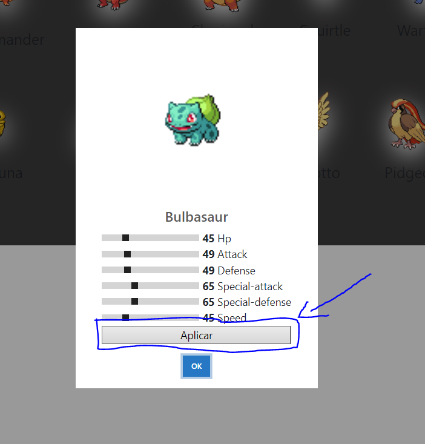

# Pokemon POST/PUT

This is the Pokemon API.
Here I use a special method which can send a pokemon to an API that saves it, if this pokemon exists it modifies it.

## API Reference

#### POST pokemones

**Method**: `POST`
**URL** : `/https://6509d04cf6553137159c10aa.mockapi.io/pokemones`

**Storage** : `pokemonMet.js`

**Module** : `enviarPokemon` 

**Querys** : `(url, data)`

**Auth Required** : `False`

```javascript
data = {
    name: "nombre",
    stats: {
        hp:12,
        attack:12,
        ...
    }
}
  
```

#### Modify pokemons 

**Method**: `PUT`
**URL** : `/https://6509d04cf6553137159c10aa.mockapi.io/pokemones`

**Storage** : `pokemonMet.js`

**Module** : `enviarPokemon` 

**Querys** : `(url, data)`

**Auth Required** : `False`

```javascript
data = {
    name: "nombre",
    stats: {
        hp:12,
        attack:12,
        ...
    }
}
```


## JSON SERVER Instalation

To install json-server in the project, we must have node, if we do not have it we can use the following tool to install Node and install npm.

### NVM installation Windows

First we will download this [NVM zip](https://github.com/coreybutler/nvm-windows/releases/download/1.1.7/nvm-setup.zip), then we will unzip it and run the normal installation.

We open a terminal and write the following command:

```shell
nvm --version
```

Now with nvm installed, we proceed on a command line to install node and npm:

```shell
nvm install 18.16.1
```

Then we verify that everything has been installed and we also verify the list of versions.

```shell
node -v
#18.16.1

npm -v
# 9.6.7
```

After having installed npm, we continue with the installation of json-server

```shell
npm -E -D install json-server 
```

To start the json-server, it will run on port 5500, so we run the following command:

```shell
npm run dev
```


## How To Use

To use the page we must click on the pokemons and see their information


Range inputs can be modified and will be sent to the mockapi


To add pokemon statistics to the mockapi what we must do is click on the "Apply" button

;


## Author

- [@johanp0308](https://github.com/johanp0308)

